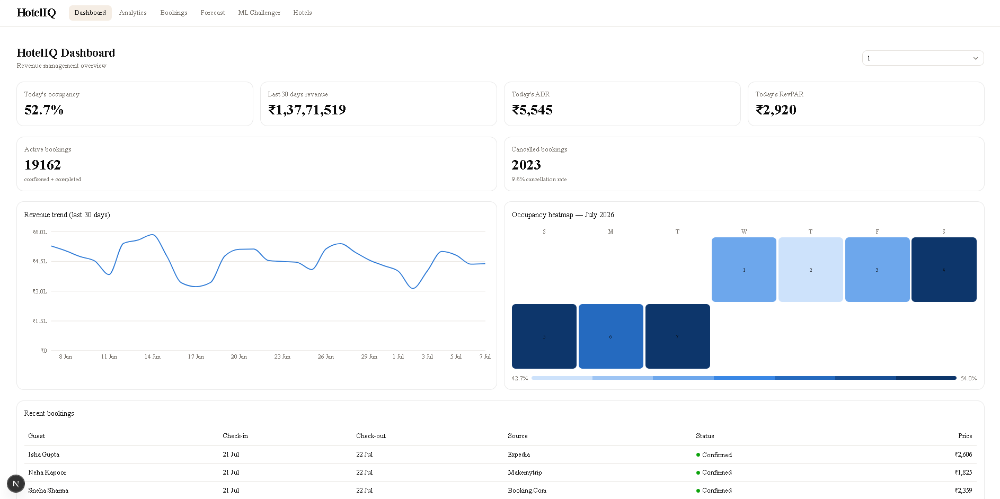
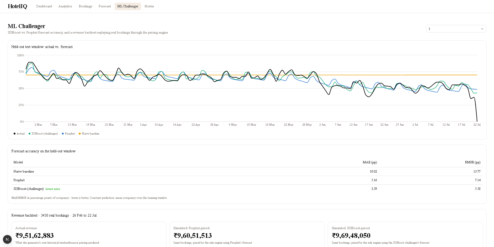
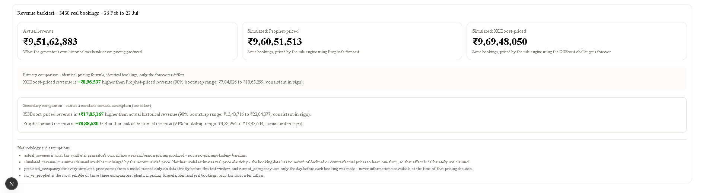
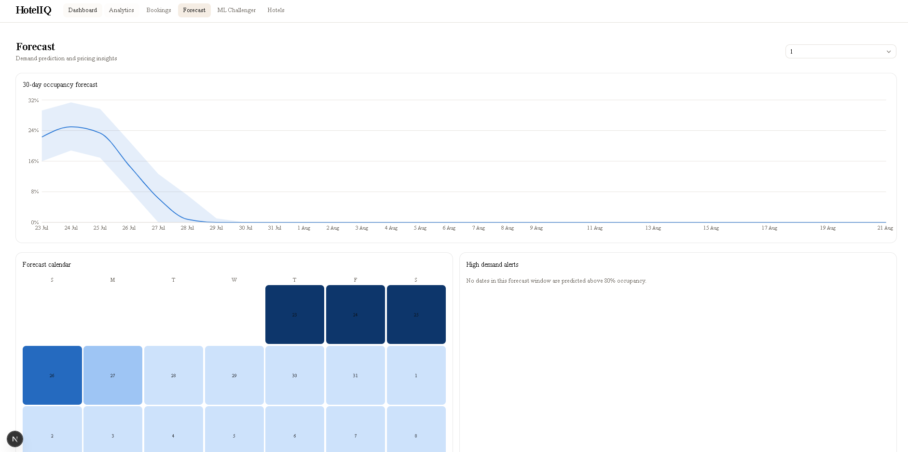
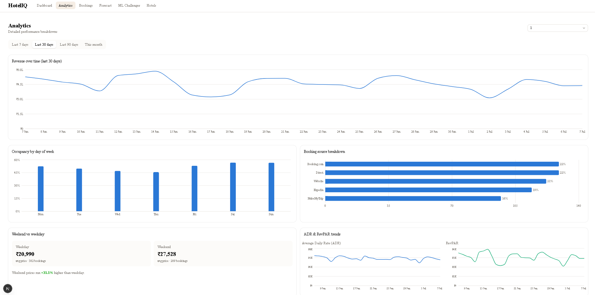

# HotelIQ — AI-Powered Hotel Revenue Management Platform

A full-stack revenue management system for hotels: demand forecasting, dynamic pricing, and analytics — built end-to-end (data pipeline → ML → API → UI) to explore how real revenue management teams use data to price rooms and forecast demand.

**Live demo:** 


### Dashboard

*Real-time occupancy, ADR, and RevPAR across all properties, with a 30-day revenue trend and an occupancy heatmap.*

### ML Challenger


*XGBoost vs. Prophet forecast accuracy on a held-out test window, plus a revenue backtest that reprices real historical bookings through the pricing engine under each model's forecast — with the methodology and assumptions stated directly next to the numbers.*

### Forecast


*30-day occupancy forecast with confidence intervals, and a dynamic pricing calculator that turns the forecast into a concrete price recommendation.*

### Analytics

*ADR/RevPAR trends, booking source breakdown, and weekend vs. weekday pricing comparison.*


## The problem

Hotels leave money on the table with static pricing. A room priced the same on a slow Tuesday in June and a packed Saturday in December ignores the single biggest lever a hotel has over its own revenue: demand-responsive pricing. HotelIQ predicts occupancy demand and turns that prediction into a concrete price recommendation, the way a real revenue management system does.

## What it does

- **Multi-hotel management** — properties, room inventory, room types and pricing
- **CSV ingestion with data-quality validation** — a real ETL pipeline (extract → validate → transform → load) that catches malformed dates, missing columns, and invalid rows rather than silently accepting bad data
- **Pre-aggregated analytics** — daily KPIs (occupancy, ADR, RevPAR, revenue) computed once and stored, not recalculated from raw bookings on every request
- **Demand forecasting** — a Prophet (Meta's time-series library) model per hotel, trained on historical occupancy, forecasting up to 90 days ahead with confidence intervals
- **Dynamic pricing engine** — a rule-based system that turns a demand forecast into a concrete price recommendation, factoring in predicted occupancy, current occupancy, weekend/season, and booking lead time
- **ML Challenger** — an XGBoost model built to challenge Prophet head-to-head, with a rigorous, honest backtest (see below) — this is the part of the project I'd point a technical interviewer to first

## Architecture

Three layers, following a deliberate separation of concerns:

```
Process Layer      Ingestion, validation, ETL, feature engineering
      ↓
Analytics Layer     Pre-aggregated KPIs (daily_metrics), smart queries
      ↓
AI Layer            Prophet forecasting · XGBoost challenger · rule-based pricing
```

**Backend:** FastAPI, SQLAlchemy, Pandas, SQLite, Prophet, XGBoost
**Frontend:** Next.js 16 (App Router, React 19), TypeScript, Tailwind CSS v4, shadcn/ui, TanStack Query, Recharts

## The ML Challenger — why it's the interesting part

Most portfolio projects that use ML call an API and show a chart. This one is built to survive the follow-up questions:

- **Time-based train/test split, never shuffled** — the model only ever trains on data strictly before the dates it's evaluated on, mirroring how a real forecast has to work.
- **No data leakage in features** — lag/rolling features (e.g., "average occupancy over the last 7 days") are computed with a shift-before-rolling pattern so a day's features never include that day's own outcome. Verified by hand against raw SQL, not just assumed correct.
- **No overclaiming what the data supports** — the booking data only records what *actually happened*, with no record of declined or counterfactual prices. That makes true price-elasticity modeling structurally impossible from this data, not just statistically weak — so the ML challenger deliberately predicts the same target Prophet does (occupancy demand), evaluated head-to-head, rather than pretending to model a price-response effect the data can't support.
- **A revenue backtest that states its own assumption out loud** — real historical bookings are repriced through the *existing, unmodified* pricing engine using each model's forecast, and the comparison is explicitly split into a strong claim ("same bookings, same pricing formula, only the forecaster differs") and a weaker one ("would this have beaten what actually happened" — which assumes demand is unchanged by price, stated in plain text next to the number, not hidden in a footnote).
- **Bootstrapped confidence intervals**, not one falsely-precise headline number.

**What it actually found:** XGBoost is the more accurate forecaster on every hotel (e.g., MAE 3.6 percentage points of occupancy vs. Prophet's 5.2 on one property) — but that doesn't uniformly translate into more simulated revenue, because the pricing engine reacts to a forecast through discrete tiers rather than a smooth function. A more accurate forecast that lands in the same pricing tier as a less accurate one produces an identical price recommendation. That's a genuine, interesting finding about how forecast quality interacts with a real pricing rule system — not a cherry-picked "our AI wins" result.

## Getting started

**Backend:**
```bash
cd backend
python -m venv venv
venv\Scripts\python.exe -m pip install -r requirements.txt
venv\Scripts\python.exe -m app.services.data_generator   # seed the database
venv\Scripts\python.exe -m uvicorn app.main:app --port 8000
```
Runs at `http://localhost:8000` (interactive docs at `/docs`). Note: Prophet depends on a C++ toolchain (CmdStan) that needs to be installed separately — see `cmdstanpy`'s install docs if `prophet` fails to import.

**Frontend:**
```bash
cd frontend
npm install
npm run dev
```
Runs at `http://localhost:3000`.

## Project structure

```
backend/
  app/
    api/          FastAPI routers (one per resource/concern)
    services/      Business logic — ETL, forecasting, pricing, ML challenger, backtesting
    models/        SQLAlchemy ORM models
    database/      Engine/session setup
frontend/
  src/
    app/           Next.js App Router pages (Server Components)
    components/    Client components, organized by feature area
    lib/api/       Typed API client
```

## What I'd do differently with more time

- Automated tests (pytest for the backend, especially the pricing engine and feature-engineering leak checks) rather than hand-verification against real numbers — hand-verification is how everything here was actually checked during development, but it doesn't scale as a long-term safety net.
- A persisted/cached model layer — right now every forecast and backtest call retrains from scratch, which is fine for a demo but wouldn't be for production traffic.
- Postgres instead of SQLite for anything beyond local development.
