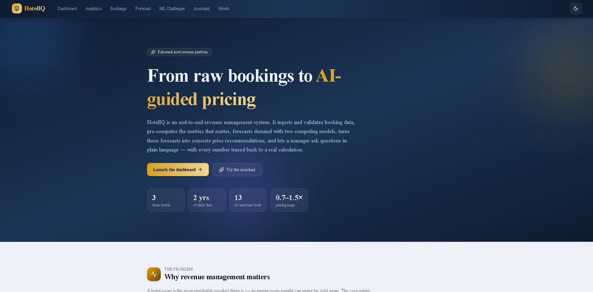
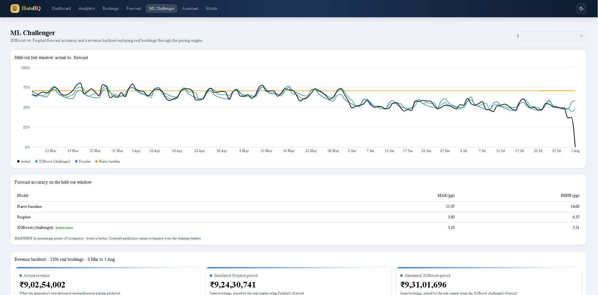
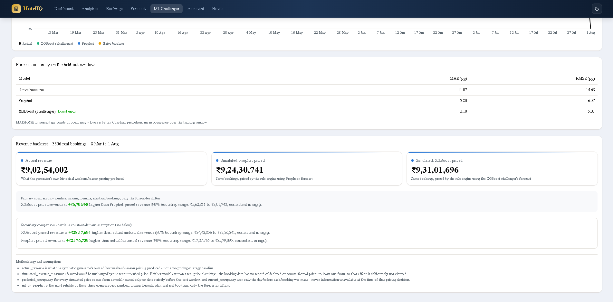
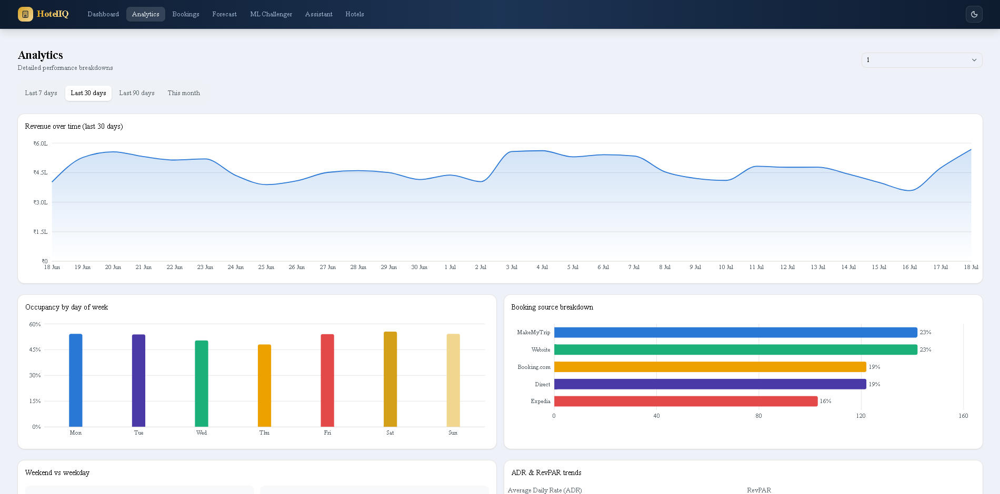
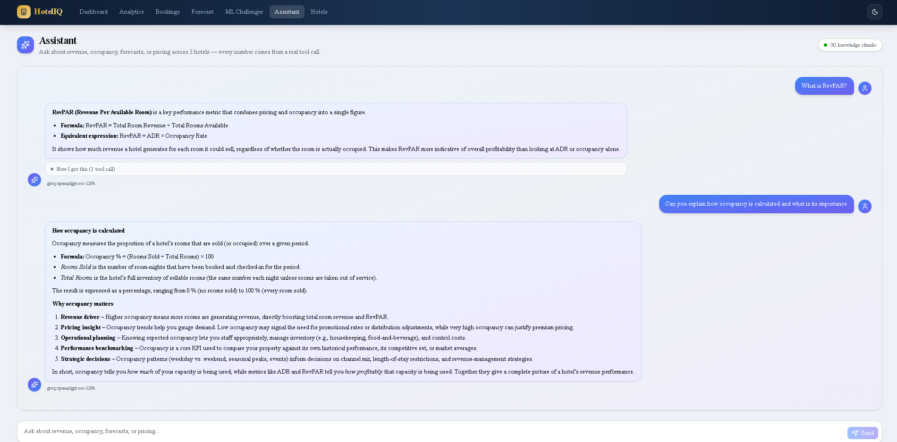

# HotelIQ — AI-Powered Hotel Revenue Management Platform

[](https://github.com/karan00190/HotelIQ_Revenue_Management_Platform/actions/workflows/ci.yml)

A full-stack revenue management system for hotels: demand forecasting, dynamic pricing, analytics, and a conversational AI assistant — built end-to-end (data pipeline → ML → API → UI) to explore how real revenue management teams use data to price rooms and forecast demand.

**Live demo:** [View the live app →](https://hotel-iq-revenue-management-platfor.vercel.app/)

### Home Page

*The landing page and entry point — a project overview that walks through the architecture, the ML methodology, and the AI layer before dropping into the app.*

### Dashboard

*Real-time occupancy, ADR, and RevPAR across all properties, with a 30-day revenue trend and an occupancy heatmap.*

### ML Challenger


*XGBoost vs. Prophet forecast accuracy on a held-out test window, plus a revenue backtest that reprices real historical bookings through the pricing engine under each model's forecast — with the methodology and assumptions stated directly next to the numbers.*

### Forecast


*30-day occupancy forecast with confidence intervals, and a dynamic pricing calculator that turns the forecast into a concrete price recommendation.*

### Analytics

*ADR/RevPAR trends, booking source breakdown, and weekend vs. weekday pricing comparison.*

### AI Assistant

*Ask about revenue, occupancy, forecasts, or pricing in plain language. Every number comes from a real tool call — the collapsible "how I got this" panel shows exactly which functions ran, so nothing is a hallucinated figure.*


## The problem

Hotels leave money on the table with static pricing. A room priced the same on a slow Tuesday in June and a packed Saturday in December ignores the single biggest lever a hotel has over its own revenue: demand-responsive pricing. HotelIQ predicts occupancy demand and turns that prediction into a concrete price recommendation, the way a real revenue management system does.

## What it does

- **Multi-hotel management** — properties, room inventory, room types and pricing
- **CSV ingestion with data-quality validation** — a real ETL pipeline (extract → validate → transform → load) that catches malformed dates, missing columns, and invalid rows rather than silently accepting bad data
- **Pre-aggregated analytics** — daily KPIs (occupancy, ADR, RevPAR, revenue) computed once and stored, not recalculated from raw bookings on every request
- **Demand forecasting** — a Prophet (Meta's time-series library) model per hotel, trained on historical occupancy, forecasting up to 90 days ahead with confidence intervals
- **Dynamic pricing engine** — a rule-based system that turns a demand forecast into a concrete price recommendation, factoring in predicted occupancy, current occupancy, weekend/season, and booking lead time
- **ML Challenger** — an XGBoost model built to challenge Prophet head-to-head, with a rigorous, honest backtest (see below) — this is the part of the project I'd point a technical interviewer to first
- **Conversational AI assistant** — ask about revenue, occupancy, forecasts or pricing in plain language. A LangChain tool-calling agent answers data questions by running the same code the dashboard uses (never by guessing a number), and answers concept questions ("what is RevPAR?") via RAG over a small knowledge base

## Architecture

Three layers, following a deliberate separation of concerns:

```
Process Layer      Ingestion, validation, ETL, feature engineering
      ↓
Analytics Layer     Pre-aggregated KPIs (daily_metrics), smart queries
      ↓
AI Layer            Prophet forecasting · XGBoost challenger · rule-based pricing
                    · conversational assistant (LangChain agent + ChromaDB RAG)
```

**Backend:** FastAPI, SQLAlchemy, Pandas, SQLite, Prophet, XGBoost, LangChain, ChromaDB, Groq, Gemini embeddings
**Frontend:** Next.js 16 (App Router, React 19), TypeScript, Tailwind CSS v4, shadcn/ui, TanStack Query, Recharts

## The ML Challenger — why it's the interesting part

Most portfolio projects that use ML call an API and show a chart. This one is built to survive the follow-up questions:

- **Time-based train/test split, never shuffled** — the model only ever trains on data strictly before the dates it's evaluated on, mirroring how a real forecast has to work.
- **No data leakage in features** — lag/rolling features (e.g., "average occupancy over the last 7 days") are computed with a shift-before-rolling pattern so a day's features never include that day's own outcome. Verified by hand against raw SQL, not just assumed correct.
- **No overclaiming what the data supports** — the booking data only records what *actually happened*, with no record of declined or counterfactual prices. That makes true price-elasticity modeling structurally impossible from this data, not just statistically weak — so the ML challenger deliberately predicts the same target Prophet does (occupancy demand), evaluated head-to-head, rather than pretending to model a price-response effect the data can't support.
- **A revenue backtest that states its own assumption out loud** — real historical bookings are repriced through the *existing, unmodified* pricing engine using each model's forecast, and the comparison is explicitly split into a strong claim ("same bookings, same pricing formula, only the forecaster differs") and a weaker one ("would this have beaten what actually happened" — which assumes demand is unchanged by price, stated in plain text next to the number, not hidden in a footnote).
- **Bootstrapped confidence intervals**, not one falsely-precise headline number.

**What it actually found:** XGBoost is the more accurate forecaster on every hotel (e.g., MAE 3.6 percentage points of occupancy vs. Prophet's 5.2 on one property) — but that doesn't uniformly translate into more simulated revenue, because the pricing engine reacts to a forecast through discrete tiers rather than a smooth function. A more accurate forecast that lands in the same pricing tier as a less accurate one produces an identical price recommendation. That's a genuine, interesting finding about how forecast quality interacts with a real pricing rule system — not a cherry-picked "our AI wins" result.

## The AI Assistant — grounded, not hallucinated

A hotel manager can ask the assistant questions in plain English. The interesting engineering isn't that it uses an LLM — it's the deliberate design to make sure it *never states a number it didn't actually compute*:

- **Tools for data, RAG for concepts — the two never mix.** A LangChain tool-calling agent has 13 read-only tools that wrap the *same* QueryBuilder / analytics / XGBoost / pricing code the rest of the app uses. Any question with a number in the answer (revenue, occupancy, a forecast, a recommended price) is answered by *calling a tool*, not by the model recalling a figure. Concept questions ("what is RevPAR?", "how does the pricing engine decide?") are answered separately by RAG over a small knowledge base. This split is the honest, interview-defensible answer to "why didn't you just RAG everything?" — you can't RAG a live revenue figure.
- **RAG over hand-written method cards.** The knowledge base is 7 curated markdown cards (≈30 chunks) in a ChromaDB vector index — the platform's own documented methodology, not scraped text.
- **A committed-embeddings design.** The corpus is embedded once with Gemini's free embeddings API and the vectors are committed to the repo as `embeddings.json`; the Docker build reconstructs the vector index from that file (and fails loudly if the corpus and embeddings have drifted apart). So there are no embedding API calls, and no secrets, at runtime or build time.
- **Free-tier by design.** Chat runs on Groq's free tier (`openai/gpt-oss-120b`); embeddings on Gemini's free API — no paid LLM usage anywhere.
- **Stateless and demo-safe.** The client resends its own short message history each turn, so the assistant survives the Render free tier spinning the backend down between requests. If a tool errors, the assistant says so plainly rather than inventing an answer.
- **Transparent by default.** Every reply carries a collapsible "how I got this" panel listing the exact tool calls and arguments behind the answer.

## Getting started

**Backend:**
```bash
cd backend
python -m venv venv
venv\Scripts\python.exe -m pip install -r requirements.txt
venv\Scripts\python.exe -m app.services.data_generator   # seed the database
venv\Scripts\python.exe -m uvicorn app.main:app --port 8000
```
Runs at `http://localhost:8000` (interactive docs at `/docs`). Note: Prophet depends on a C++ toolchain (CmdStan) that needs to be installed separately — see `cmdstanpy`'s install docs if `prophet` fails to import. The conversational assistant additionally needs a free `GROQ_API_KEY` (and, for knowledge search, a free `GEMINI_API_KEY`) in the environment; without them the rest of the app runs fine and the assistant reports itself as "not configured."

**Frontend:**
```bash
cd frontend
npm install
npm run dev
```
Runs at `http://localhost:3000`.

**Running the tests:**
```bash
# backend — 64 tests
cd backend
venv\Scripts\python.exe -m pip install -r requirements-dev.txt
venv\Scripts\python.exe -m pytest

# frontend — Vitest
cd frontend
npm run test
```

## Project structure

```
.github/
  workflows/       CI — runs the backend + frontend test suites on every push/PR
backend/
  app/
    api/           FastAPI routers (one per resource/concern)
    services/      Business logic — ETL, forecasting, pricing, ML challenger, assistant
    knowledge/     Assistant RAG corpus (method cards + committed embeddings.json)
    models/        SQLAlchemy ORM models
    database/      Engine/session setup
  tests/           pytest suite (unit, DB-backed, and API integration)
frontend/
  src/
    app/           Next.js App Router pages (Server Components)
    components/    Client components, organized by feature area
    lib/api/       Typed API client
```

## Testing

64 backend tests (pytest) and a frontend Vitest suite, run on every push and pull request by GitHub Actions (the badge at the top of this README). The coverage is deliberately aimed at the *risky* logic, not at a coverage percentage:

- **Pure-logic unit tests** — every tier of the pricing engine, all nine data-quality validation checks, and the feature-engineering calculations, each asserted against hand-computed values.
- **The leakage guard** — the flagship test. It builds a known occupancy series and asserts the shift-before-rolling feature math excludes the current day, so the exact target-leakage bug the ML challenger was designed to avoid can't quietly return. To prove the test actually bites, the bug was temporarily reintroduced during development and the test failed as intended, then the fix was restored.
- **DB-backed service tests** — analytics, smart queries, and the assistant's tools run against a small, hand-seeded in-memory SQLite database, so every expected revenue/occupancy number is one I computed by hand.
- **API integration tests** — real HTTP requests through FastAPI's `TestClient` with the database dependency overridden to the seeded fixture.

This is the automated safety net that replaces the hand-verification used during development — which was thorough, but didn't scale.

## What I'd do differently with more time

- A persisted/cached model layer — right now every forecast and backtest call retrains from scratch, which is fine for a demo but wouldn't be for production traffic.
- Postgres instead of SQLite for anything beyond local development.
